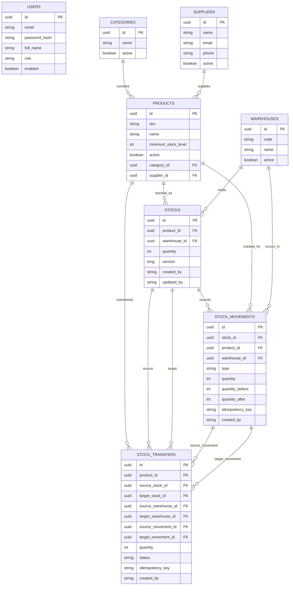

# Warehouse Inventory System

Spring Boot based warehouse inventory API for managing product catalog data, warehouses, stock levels, stock movements, transfers, low stock reports, idempotent operations, and audit metadata.

## Tech Stack

- Java 21
- Spring Boot 4.1
- Spring Web MVC
- Spring Security with JWT
- Spring Data JPA and Hibernate
- PostgreSQL
- Flyway
- MapStruct
- JUnit 5, MockMvc, Testcontainers
- Docker and Docker Compose

## Domain Scope

The system is built around stock correctness rather than plain CRUD.

- Products belong to categories and can optionally have suppliers.
- Warehouses hold product-specific stock records.
- Stock in, stock out, adjustment, and transfer operations create immutable movement history.
- Stock cannot go negative.
- Warehouse transfers are atomic and create one `TRANSFER_OUT` and one `TRANSFER_IN` movement.
- Optimistic locking prevents lost updates on the same stock row.
- `Idempotency-Key` can be used on stock changing requests to avoid duplicate application.
- Low stock is calculated from each product's `minimumStockLevel`.

## Run With Docker

Build and start the API plus PostgreSQL:

```bash
docker compose up --build
```

Useful URLs:

- API health: [http://localhost:8080/api/v1/health](http://localhost:8080/api/v1/health)
- Swagger UI: [http://localhost:8080/swagger-ui.html](http://localhost:8080/swagger-ui.html)
- OpenAPI JSON: [http://localhost:8080/v3/api-docs](http://localhost:8080/v3/api-docs)

Stop the stack:

```bash
docker compose down
```

Remove database volume:

```bash
docker compose down -v
```

## Run Locally

Start only PostgreSQL:

```bash
docker compose up postgres
```

Run the application:

```bash
mvn spring-boot:run
```

Default local configuration:

```text
DB_URL=jdbc:postgresql://localhost:5432/warehouse_inventory
DB_USERNAME=warehouse_user
DB_PASSWORD=warehouse_password
JWT_SECRET=super-duper-very-secret-bit
JWT_EXPIRATION_MINUTES=60
```

Run tests:

```bash
mvn test
```

The PostgreSQL Testcontainers test is skipped automatically when Docker is not available.

## Authentication

Register an admin:

```bash
curl -X POST http://localhost:8080/api/v1/auth/register \
  -H "Content-Type: application/json" \
  -d '{
    "email": "admin@example.com",
    "password": "StrongPass123!",
    "fullName": "Admin User",
    "role": "ADMIN"
  }'
```

Login:

```bash
curl -X POST http://localhost:8080/api/v1/auth/login \
  -H "Content-Type: application/json" \
  -d '{
    "email": "admin@example.com",
    "password": "StrongPass123!"
  }'
```

Use the returned token:

```bash
export TOKEN="<jwt-token>"
```

## API Examples

Create category:

```bash
curl -X POST http://localhost:8080/api/v1/categories \
  -H "Authorization: Bearer $TOKEN" \
  -H "Content-Type: application/json" \
  -d '{
    "name": "Electronics",
    "description": "Electronic components",
    "active": true
  }'
```

Create product:

```bash
curl -X POST http://localhost:8080/api/v1/products \
  -H "Authorization: Bearer $TOKEN" \
  -H "Content-Type: application/json" \
  -d '{
    "sku": "SKU-001",
    "name": "Barcode Scanner",
    "description": "Handheld scanner",
    "categoryId": "<category-id>",
    "minimumStockLevel": 5,
    "active": true
  }'
```

Create warehouse:

```bash
curl -X POST http://localhost:8080/api/v1/warehouses \
  -H "Authorization: Bearer $TOKEN" \
  -H "Content-Type: application/json" \
  -d '{
    "code": "MAIN",
    "name": "Main Warehouse",
    "address": "Main industrial zone",
    "active": true
  }'
```

Create stock record:

```bash
curl -X POST http://localhost:8080/api/v1/stocks \
  -H "Authorization: Bearer $TOKEN" \
  -H "Content-Type: application/json" \
  -d '{
    "productId": "<product-id>",
    "warehouseId": "<warehouse-id>"
  }'
```

Stock in with idempotency:

```bash
curl -X PATCH http://localhost:8080/api/v1/stocks/stock-in \
  -H "Authorization: Bearer $TOKEN" \
  -H "Idempotency-Key: receive-001" \
  -H "Content-Type: application/json" \
  -d '{
    "stockId": "<stock-id>",
    "quantity": 10,
    "reason": "Initial receive"
  }'
```

Transfer between warehouses:

```bash
curl -X POST http://localhost:8080/api/v1/stock-transfers \
  -H "Authorization: Bearer $TOKEN" \
  -H "Idempotency-Key: transfer-001" \
  -H "Content-Type: application/json" \
  -d '{
    "sourceStockId": "<source-stock-id>",
    "targetWarehouseId": "<target-warehouse-id>",
    "quantity": 3,
    "reason": "Replenishment"
  }'
```

Movement history:

```bash
curl "http://localhost:8080/api/v1/stock-movements?productId=<product-id>&warehouseId=<warehouse-id>&sort=createdAt,desc" \
  -H "Authorization: Bearer $TOKEN"
```

Low stock report:

```bash
curl http://localhost:8080/api/v1/reports/low-stock \
  -H "Authorization: Bearer $TOKEN"
```

Dashboard metrics:

```bash
curl http://localhost:8080/api/v1/reports/dashboard \
  -H "Authorization: Bearer $TOKEN"
```

## Architecture

The package layout follows a layered structure:

```text
web               REST controllers and request/response DTOs
application       business services and MapStruct mappers
domain            JPA entities and domain behavior
infrastructure    persistence repositories and security adapters
config            framework configuration
common            shared errors and exception handling
```

Important flows:

- Controllers enforce role-based access with method security.
- Services own business rules and transaction boundaries.
- Domain entities protect stock invariants.
- Repositories expose persistence and query/filter operations.
- Flyway owns schema changes and keeps JPA on `ddl-auto=validate`.

## ER Diagram



## Testing Strategy

- Domain unit tests cover stock invariants.
- MockMvc integration tests cover auth, catalog, stock operations, transfer rollback, reporting, and idempotency.
- Repository and transaction tests cover optimistic locking behavior.
- Global exception tests protect the API error contract.
- Testcontainers validates PostgreSQL migrations when Docker is available.

## CI

GitHub Actions runs on pushes to `main` and `dev`, plus pull requests:

- `mvn -B test`
- `docker build -t warehouse-inventory-system:ci .`

## Future Improvements

- Add refresh tokens and token revocation.
- Add user-facing audit endpoints.
- Add richer reporting by date bucket and warehouse.
- Add import/export jobs for catalog and stock data.
- Add rate limiting for auth endpoints.
- Add production observability with metrics and tracing.
- Add deployment manifests for a cloud platform.
